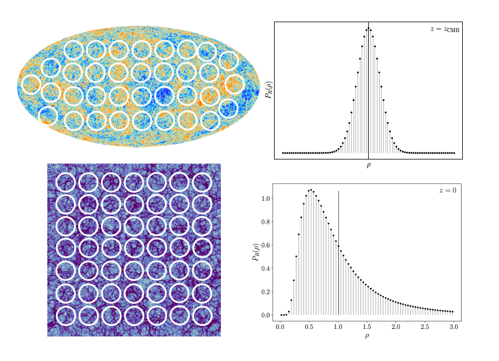
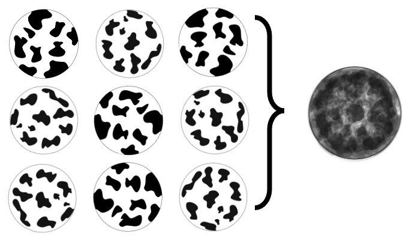
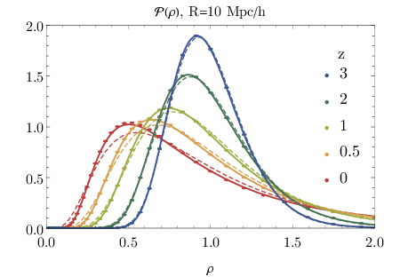
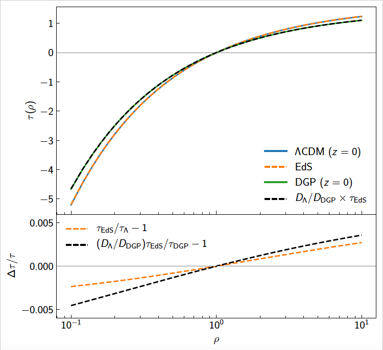
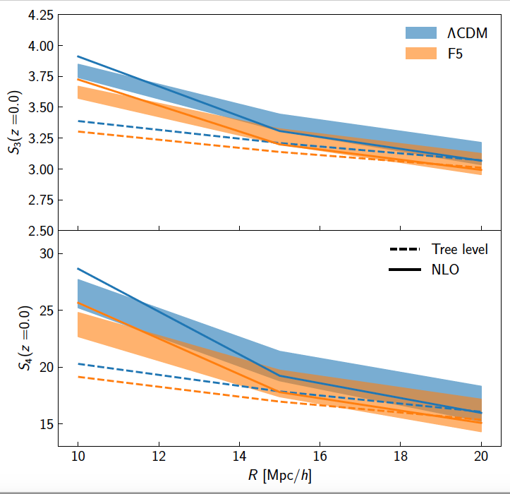
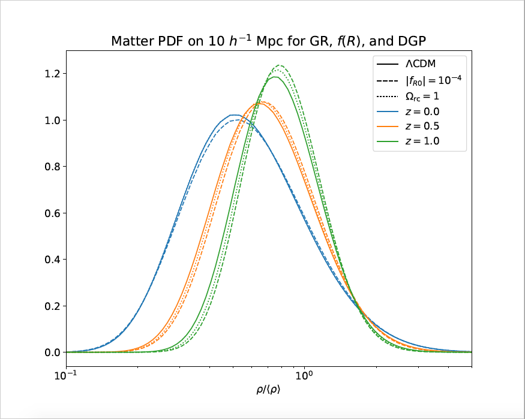
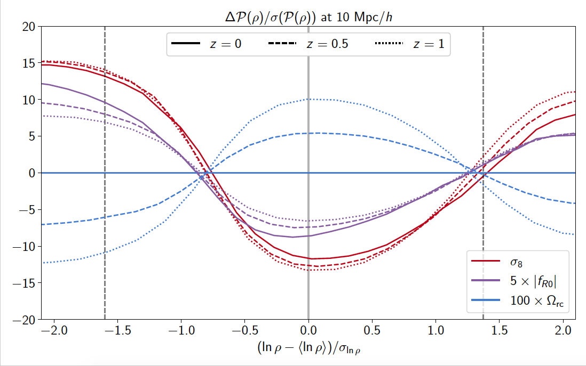
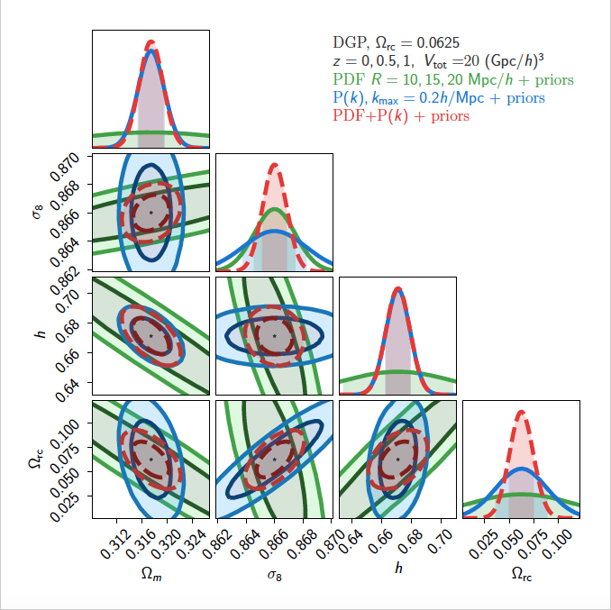
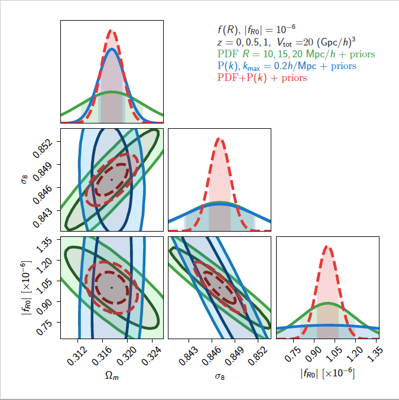

Today the first paper from work done during my PhD was put up on [arXiv](https://arxiv.org/abs/2109.02636). I’ve given several talks about this project before and wrote a [Twitter thread](https://twitter.com/acwgough/status/1349756493214658564?s=20) in the early stages of my involvement in the project, but now it’s complete, here's a more comprehensive summary to the paper. Huge thanks to Matteo Cataneo for letting me hop on this project and do a large chunk of analysis, and to my supervisor Cora Uhlemann for actually teaching me how to do so! (and to my other co-authors Christian Arnold, Baojiu Li, and Catherine Heymans for very important involvement including actually running the simulations we rely on to validate our results).

This write-up is largely based on a talk I’m giving at the [Alternative Gravities and Fundamental Cosmology](https://indico.cern.ch/event/873762/) conference next week, so people with a strong background in the field. I do aim to keep things fairly contained, but if you have further questions about the paper please don’t hesitate to [drop me an email!](mailto:a.gough2@newcastle.ac.uk) The tone and style is very conversational, and perhaps too verbose, but this is for my own edification mostly, and how I would explain things in conversation to another student at a similar stage to me.

I will pepper in a few references throughout this write up, but for complete references please refer to the actual paper. Anyone who has written a paper before knows that referencing is a pain and I don't want to have to do it manually in markdown for my website.

## Motivation
People interested in this paper probably fall into two camps (though the intersection is also non-empty). You might be interested in modifications to gravity, and how we can test that using cosmology data, in which case, we demonstrate a tool which does a good job of extracting that sort of information. Or you might be interested in statistical tools at use in cosmology, and be looking at new places to apply them to see what you can learn. In this case, we show you can learn about extensions to the standard cosmological model with simple one-point statistics.

## Standard tools for cosmology
Information in cosmology is quantified statistically. We don’t care if a galaxy is at any given position, and indeed we can’t calculate that without perfect knowledge of the initial conditions of the universe and a universe’s worth of computational power. What we can do is quantify the distribution of galaxies (and other cosmic fields) by their statistics.

The principle tool for this in cosmology is the 2-point correlation function (or it’s Fourier twin the power spectrum). This is constructed by considering pairs of points a fixed distance apart, and looking at their correlations. Doing this for several pairs in data, over a range of distances, constructs the 2-point correlation function.

If the field of interest is a Gaussian random field, that’s it. You’re done. For the early universe, this is good news, since the universe at the time of the CMB appears to be a nearly perfect Gaussian field. However, as matter collapses due to gravity, even Gaussian fields become non-Gaussian. This is due to the fact that gravitational collapse is a non-linear process, which translates to non-Gaussian statistics. Therefore, if you’re interested in the late universe, the power spectrum simply isn’t enough.

And you should be interested in the late universe (and not just because that’s where we live!). The large scale structure of the universe is essentially a 3D movie of the universe over time, while the CMB, where most of our current constraints come from, is a 2D still image. If we can disentangle the non-linear information from the large scale structure, there’s potentially orders of magnitude more information in the late universe than the CMB alone.

## Simple statistics for complex problems
So what are we to do? One standard approach for constructing non-Gaussian statistics is to construct the N-point correlation functions. There you drop 3 or 4 or N points in your field, and then measure their correlation as a function of the shape they make. The problem with this strategy is that N-point functions are tricky to measure and tricky to extract information from. The 3-point function (cousin of the bispectrum) requires keeping track of the shape and size of triangles on the sky, rather than just a distance between points as in the power spectrum. Certainly people do it, but are there alternatives? (Spoiler alert, this would be a much shorter post if the answer were no.)

Our choice of statistic is the matter probability distribution function (PDF), which is a type of “one-point function”, and it is particularly simple to measure. Simply take your field of interest, be it the CMB or the cosmic web, and drop circles/spheres of a fixed size on it. Within each sphere, calculate the mean matter density, then make a histogram of the result.

||
|:--:|
|*Figure 1: PDFs measured from the CMB and from the large scale structure.*|

For the CMB the result is a nearly perfect Gaussian, quantified simply by its width. For the large scale structure we obtain a much more interesting distribution. The main features of the matter PDF at late times are that its peak lies in underdense regions, meaning that most of the volume of the universe is less dense than average. Additionally the high density tail of the distribution is heavier than a Gaussian distribution would be, amplified by the presence of gravitationally collapsed structures.

## Does anybody have a map?
The question now becomes can we somehow find an analytic way to move from the nicely Gaussian initial distribution to the non-Gaussian distribution at late times?

As good theoretical physicists always should, we return to spherical cows. Considering several spheres of the same average density, the PDF statistic throws away any spatial information related to them. That means that the average profile for a given density should be spherically symmetric, as we stack more and more spheres on top of each other. Symmetry is always nice, and hopefully a tool we can leverage into a mapping between our distributions.

||
|:--:|
|*Figure 2: Spheres with the same mean density all get stacked on top of each other by the matter PDF, which results in a spherical distribution.*|

The framework we need to do this is called Large Deviation Theory (LDT).

LDT is a mathematical framework which deals with the tails of probability distributions. An excellent introduction paper (at the level of physicists) is [by Touchette](https://arxiv.org/abs/1106.4146). I will not go into any details of the theorems here, since that takes us too far afield (though I will write up something on that someday, I promise) but rather will just quote the main principles we need.

Probability distributions satisfying a Large Deviation Principle (LDP) have the general form

$$
P(x) \sim e^{-N\psi(x)}
$$

where $N$ is some large number called the driving parameter and $\psi$ is called the rate function (think calculating the sample mean for $N$ samples). The large deviation principle contains within it the central limit theorem: when near the peak $x=x^*$, we can Taylor expand the rate function and obtain

$$
P(x) \sim e^{-\frac{1}{2}N\psi’’(x^*)(x-x^*)^2}.
$$

For our purposes, the feature of LDT we need is that **if our statistic has a particular symmetry, the dynamical mapping between variables is dominated by that same symmetry**. For our case what this means is, since the PDF of the final density is spherically symmetric, the mapping from initial to final densities is dominated by evolution that is also spherically symmetric.

This is excellent news, as spherical collapse is an evolution mapping we can actually solve for (at least in GR)! In the case of an Einstein de Sitter universe, we can actually write down an analytic form of the mapping, but in $\Lambda$CDM at least we can solve it numerically.

A series of papers work out the details of what the appropriate rate function is for the matter PDF and the final form of the PDF as predicted by LDT, they are given by ([Uhlemann et al. (2016)](https://arxiv.org/abs/1512.05793), [Bernardeau & Reimberg (2016)](https://arxiv.org/abs/1511.08641)):

$$
P_R(\rho) = \sqrt{\frac{\psi_R’’(\rho) + \psi_R’(\rho)/\rho}{2\pi}}e^{-\psi_R(\rho)}
$$

(which has $P_R(\rho) \sim e^{-\psi_R(\rho)}$ as expected)
and

$$
\psi_R(\rho) = \frac{\sigma^2_{\rm L}(R)}{\sigma^2_{\rm L}(R\rho^{1/3})}\frac{\tau^2(\rho)}{2\sigma^2_{\rm NL}(R)}.
$$

The rate function relies on three ingredients:

* **Linear theory.** The first fraction is a ratio of linear variances. This is fortunately easy to compute using Boltzmann codes.
* **Spherical collapse.** This is the key input from LDT. $\tau(\rho)$ means the initial density corresponding to final density $\rho$, as given by the 1-to-1 spherical collapse mapping.
* **Non-linear variance.** This plays the role of the driving parameter from LDT (e.g. our equations become exact in the limit where $\sigma_{\rm NL}\to 0$). You can regard this either as a single parameter to measure from simulation or as a single free parameter of the model.

This model does very well for $\Lambda$CDM universes, as demonstrated in e.g. [Uhlemann et al. (2016)](https://arxiv.org/abs/1512.05793), [Bernardeau & Reimberg (2016)](https://arxiv.org/abs/1511.08641), and [Uhlemann et al. (2019)](https://arxiv.org/abs/1911.11158). We only need weak theoretical assumptions and we get accurate predictions even at redshift 0 and on scales as small as 10 Mpc/$h$ (where things are most non-linear). All this with only a few analytic ingredients.

||
|:--:|
|*Figure 3: The matter PDF compared to the Quijote simulation measured points. Reproduced from Figure 6 of [Uhlemann et al. 2019](https://arxiv.org/abs/1911.11158).*|

## Extending the cosmology

Can we replicate this success for non-$\Lambda$CDM cosmologies? That’s what our paper is actually about (finally!).

In principle when moving to modified gravity (MG) or dark energy (DE) cosmologies (generically called extended cosmologies) we would need to update the three ingredients above: linear variance, non-linear variance, and spherical collapse dynamics.

* **Linear theory** is easy to update, do this with your favourite model!

* The **non-linear variance** is trickier. One way of doing this is to run lots of expensive simulations for values of your extended cosmology you care about and measure the non-linear variance from that. Fortunately we’ve done that for you and it turns out you can get an answer accurate to 1% much more easily via the “lognormal approximation” (equation 21 in the paper). For this, you only need a non-linear variance at one fiducial cosmology, and then you can change this to predict the non-linear variance at other cosmologies just using linear theory. In all the cases we considered this lead to PDFs which were accurate to at worst 2% even in the extended cosmology cases.

* **Spherical collapse dynamics** could have been the real kick in the teeth for LDT in extended cosmologies though. Modified gravity in particular can get really tricky here, since scale-dependent fifth-forces (as in $f(R)$) make it impossible to write down a single spherical collapse mapping. Fortunately we are saved provided we restrict ourselves to mildly non-linear scales ($>10 \ \text{Mpc}/h$). In this case, we can use the same spherical collapse mapping as in GR (we actually use the EdS collapse mapping for the paper).

Figure 1 in the paper shows that provided we rescale the mapping by the difference in linear growth, EdS spherical collapse matches the exact spherical collapse from DGP gravity (a scale independent modification to gravity).

Figure 2 in the paper looks at the case of a scale dependent modification, where we can’t write down an exact mapping to compare against. However, we can compare the reduced cumulants $S_3, S_4$ (which are closely related to the skewness and kurtosis) measured from simulation to predictions based off of EdS collapse as a proxy for how well we’re reproducing the mapping.

||
|:--:| :--:|
| *Figure 4: Reproducing Figure 1 from the paper* |*Figure 5: Reproducing part of Figure 2 from the paper* |

Now we can actually look at some PDFs (see Figure 5). By modifying gravity or dark energy, generically changes both the width and the shape of the PDF. But we already have a cosmological parameter which changes the width of the PDF, $\sigma_8$, the clustering amplitude. To see the effect of MG/DE on our PDF we can set the initial parameters to produce the same $\sigma_8$ value at redshift 0. If there is still residual difference then we have some hope of telling MG/DE apart from just a slightly different value of $\Lambda$CDM parameters.

||
|:--:|
|*Figure 6: PDFs from different theories of gravity.*|

As you can see in this Figure, there is indeed hope! In both $f(R)$ and DGP gravity, there is a significantly different redshift dependence than in $\Lambda$CDM. *(Two caveats. For this figure I used larger MG parameters than in the paper to make the effect more visible. It still works with the values used in the paper. I didn’t include DE models on this plot because the effect is similar to DGP gravity, mostly entering in modifying the expansion history.)*

To get constraints on modified gravity parameters (and others) we need to know how the PDF varies with cosmological parameters. For example, increasing the value of $\sigma_8$ increases the width of the PDF, and decreases the height of the peak. Since the PDF is normalised, the tails must therefore move up. In a plot of the derivatives, this shows up as being negative in the centre and positive in the tails (see the red lines in Figure 7 here/Figure 11 in the paper). *Unscientific note: this plot is my favourite in the paper, and not just because I made it. I think it is the most instructive way to see* **why** *what we're doing has a chance at working to constrain gravity.*

We can now compare the shape of the MG derivatives to the $\sigma_8$ derivatives. We see that the DGP derivatives are the same shape as the $\sigma_8$ derivatives, but with different redshift dependence. The DE derivatives are similar, but harder to show on a single plot since there are two parameters which modify the growth rate. The $f(R)$ derivatives are even better (from the perspective of breaking degeneracies), since there is an additional skewness in the derivatives, sourced from the scale-dependent fifth-force. Additionally the $f(R)$ derivatives do not vanish at redshift 0 as the DGP and DE derivatives do, which allows us to extract more non-linear information. *(Technical caveat. While these facts make the constraints on $f(R)$ better than the other models, we trust the results on DGP and DE more, since the lognormal approximation for the non-linear variance is better, see the appendix of the paper.)*

||
|:--:|
|*Figure 7: PDF derivatives for $\sigma_8$ and MG parameters*|

## Results
We ran Fisher analyses on these three models, marginalising over all other $\Lambda$CDM parameters. We included a prior on $\Omega_b$ and $n_s$ to avoid differences in the power spectrum as predicted from theory using HMcode and as measured in our simulations (again, see the appendix).

||
|:--:| :--:|
| *Figure 8: Fisher for DGP. From Figure 9 in the paper.*  |*Figure 9: Fisher for $f(R)$. From Figure 10 in the paper.* |

For the PDFs we considered 3 scales of 10, 15, and 20 Mpc, at three redshifts 0, 0.5, and 1, with a total volume corresponding to a Euclid-like survey. We compared this to the constraints from the matter power spectrum at the same redshifts up to $k_{\rm max}=0.2 \ h/\rm Mpc$. In all cases considered the PDF provides an excellent complement to the matter power spectrum. For DGP gravity it doubles the constraining power of the power spectrum, while in the $f(R)$ case it increases it by a factor of 6.

For the dark energy case we used a $w_0w_a$CDM model. In this case we increased measurements on $\sigma_8$, $w_0$, and $w_a$ by a factor 2.5 compared to power spectrum alone, and the figure of merit increases by a factor of 5.

## Takeaways
Hopefully I’ve managed to convince you that the matter PDF is a powerful tool to use in general in cosmology, and in particular for the case of examining extended cosmologies. Having the analytic framework of large deviation theory based on physical principles is theoretically satisfying and practically useful, and is an ongoing area of application. The final thing I’d like to advertise is that the code used to produce these PDFs, called [pyLDT is now publicly available](https://github.com/mcataneo/pyLDT-cosmo). It comes with 4 models out of the box and a tutorial jupyter notebook, but it is easily extendable to your favourite theory.

There’s still a lot of work to do in this space, including moving from predictions about the matter field to observable quantities such as convergence lensing maps or halo densities. There are niggles like baryons and redshift-space distortions which are in various stages of being dealt with. But the results are promising, and I’m looking forward to continuing to work in this space during my PhD.
