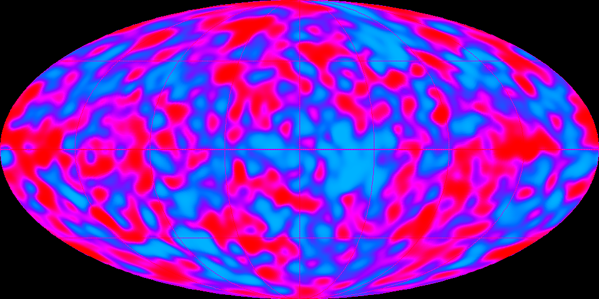
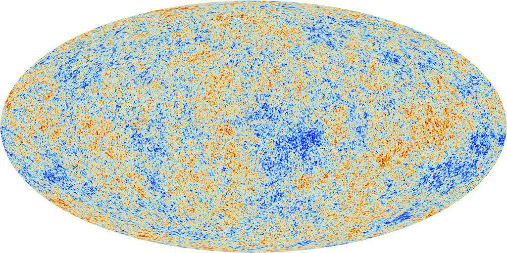
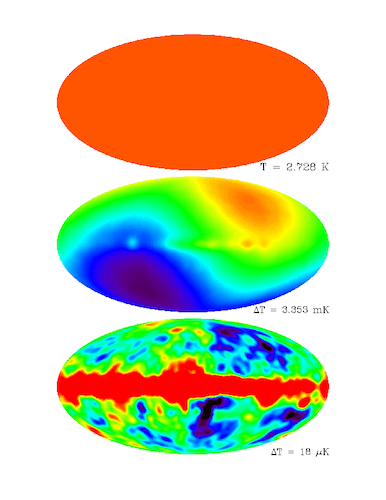

This post is Part 1 of a series I'm planning on writing based on a Reddit AMA (Ask Me Anything) that I participated in as part of the [Cosmology From Home 2020 conference](https://www.cosmologyfromhome.com/). You can read through AMA questions and answers by me and other people at the conference [here](https://www.reddit.com/r/askscience/comments/imdw7e/askscience_ama_series_we_are_cosmologists_experts/?utm_source=share&utm_medium=web2x&context=3) or watch the [YouTube live stream](https://youtu.be/NBAtZqfKF24) of our discussions.

--

# The Cosmic Microwave Background

As the first post in this series, I've decided to focus on one of the most important objects in cosmology: the Cosmic Microwave Background (CMB). This post will focus on the following questions:

1. What is the CMB?
1. What can we learn from it?
1. How do cosmologists study it?

## 1. What is the CMB?

Start with talking through the CMB from a theoretical perspective, then the maps.

**Insert Intro Here**

Any of you who have heard of the CMB before will have also seen maps of the CMB like the following:

||
|:--:| :--:|
| *Figure 1: Fluctuations in the CMB taken by the COBE sattelite. Image taken from [Wikipedia](https://en.wikipedia.org/wiki/Cosmic_Background_Explorer).* |*Figure 2: Fluctuations in the CMB taken by the Planck Sattelite. Image taken from the [European Space Agency Website](https://www.cosmos.esa.int/web/planck/picture-gallery).* |

These maps show the strenth of microwave signal in different directions of the sky. The redder spots are slightly more energetic (hotter) microwaves, while the blue spots are slightly colder microwaves. *"But wait!"* you might say. *"These maps don't look uniform at all! You said that the signal was the same in all directions, but this map is all splotchy."* Good! This is true, and that's becuase these maps don't tell the whole story of what we're detecting.

In the 1960s, when the first measurements of the CMB were made, the map was very boring, and was indeed just a single colour across the whole sky, but that map isn't very interesting to put in press releases. This uniform signal corresponds to microwaves with a temeperature of 2.728 K, just under 3 degrees over absolute zero. With the space telescope COBE, we could begin to detect very small deviations around this average temperature. If we can measure temperature differences of milli-Kelvin (0.001 K) then we see that one half of the sky looks slightly hotter than average, and the other half of the sky looks slightly colder than average. This is called the *dipole* of the CMB, and is due to the fact that the Earth and the Milky Way are moving with respect to this background radiation. This relative motion creates a Doppler shift in the frequency of the microwaves we see, making the direction we're moving in hotter, and moving away from colder. In fact, from measuring how big this dipole is, we can measure how fast and in what direction we're moving relative to the CMB.

If we can measure temperature differences even more fine than that, down to about 10 micro-Kelvin (0.00001 K) then we start to see these splotchy patters seen in the maps shown in Figures 1 and 2. So the CMB is indeed *very* uniform. If we ignore the effect of our motion relative to the CMB, the inhomogeneities of the CMB are about 10 parts in a million. Figure 3 shows the uniform, dipole, and higher anisotropies map from the COBE sattelite.

||
|:--:|
|*Figure 3: Caption, [attribution](https://aether.lbl.gov/www/projects/cobe/COBE_Home/DMR_Images.html)*|

The eagle eyed reader will also notice that there's something funny going on in the bottom subfigure of Figure 3: there's a big horizontal band of hotter than average microwaves that isn't present in either Figure 1 or 2. This is a picture of our own galaxy in microwaves! There are many things in the Milky Way that produce microwaves, and these add to our signal, on top of the microwaves from the early universe. In general, these sources are called "galactic foregrounds" and are rather a nusance to deal with. Ideally we want to model what the galaxy is doing, and then subtract that signal from our map to end up with the nice, clean maps like at the beginning of this section. This is difficult to do, and actually something I did a research project on, I may write about that another time. 

So that's the story of these maps. To get the nice clean maps from Planck (the most recent CMB telescope) you have to detect fluctuations of only 10 parts per million in the temperature difference of microwaves, subtract off the effect of the Earth and galaxy's motion, and somehow deal with the fact that many other things in our own galaxy make microwaves which are not part of the CMB. A tall task, and a lot of work. So what can we learn from the CMB at all then?

# 2. What the CMB can tell us.

The first thing about the CMB is that it is very strong evidence for the Big Bang. This might seem backwards based on how I introduced the topic in section 1—I first talked you through the thermal history of the universe, and then described what we see on the sky because of it— in reality, the discovery worked the other way around. X and Y discovered a strange microwave signal with nearly the same strength everywhere in the sky, then they and others developed a scientific theory which includes that as a prediction. This is often the case in science, the historical route to discovery/development of a theory or method is rarely the best pedagogical route into thinking or learning about it, precisely because the historical route has many deadends, pitfalls, and is working out every step as it goes. We now have the ability to look back in hindsight and find the best way to explain it.

The existence of the CMB is very well predicted by the theory that, in the past, the universe was much smaller, and much hotter than it was now, which is what cosmologists mean when they talk about the Big Bang (sometimes the "hot Big Bang") theory. Even better than that though, the small anisotropies contain a lot of different information about the buildup of our universe.

## Additional Attributions and further references
* Figure 1: The COBE datasets were developed by the [NASA Goddard Space Flight Center](https://www.nasa.gov/goddard) under the guidance of the [COBE Science Working Group](https://lambda.gsfc.nasa.gov/product/cobe/swg.cfm).

